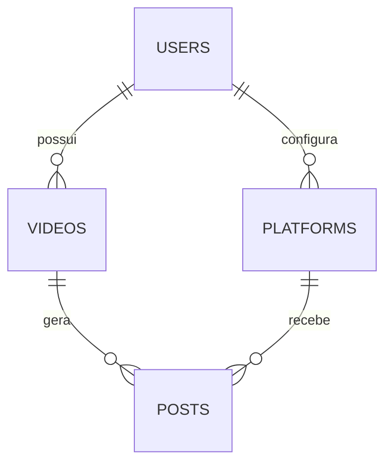

# Modelagem de Dados

Este documento descreve a primeira versão do modelo relacional utilizado pelo **pratikapp**.

## Visão Geral

O objetivo do banco é organizar o fluxo entre usuários, vídeos importados do Google Drive, plataformas conectadas e postagens agendadas. A modelagem é composta por quatro tabelas principais, acompanhadas de enums para status e uma visão agregada para facilitar consultas do painel.

## Tabelas

### `users`

- **id** `uuid` (PK)
- **name** `text`
- **email** `citext` (único)
- **avatar_url** `text`
- **created_at** `timestamptz`

### `videos`

- **id** `uuid` (PK)
- **user_id** `uuid` (FK → `users.id`, cascade)
- **title** `text`
- **description** `text`
- **url_drive** `text`
- **scheduled_date** `timestamptz`
- **status** `video_status`
- **created_at / updated_at** `timestamptz`

### `platforms`

- **id** `uuid` (PK)
- **user_id** `uuid` (FK → `users.id`, cascade)
- **name** `text`
- **api_token** `text`
- **created_at** `timestamptz`

### `posts`

- **id** `uuid` (PK)
- **video_id** `uuid` (FK → `videos.id`, cascade)
- **platform_id** `uuid` (FK → `platforms.id`, cascade)
- **status** `post_status`
- **posted_at** `timestamptz`
- **error_message** `text`
- **created_at** `timestamptz`

## Enums de Status

- `video_status`: `draft`, `scheduled`, `pending`, `processing`, `posted`, `failed`
- `post_status`: `pending`, `uploading`, `posted`, `failed`

## Relacionamentos

## Índices e Performance

- `videos(user_id)` acelera listagens por usuário logado.
- `videos(status)` apoia os processos de agendamentos/filas.
- `posts(video_id)` e `posts(platform_id)` sustentam dashboards filtrados.
- `posts(status)` permite localizar postagens pendentes/erro.

## Visão Agregada

A _view_ `video_post_status` consolida o status das postagens de cada vídeo, retornando JSON com o histórico por plataforma.

## Próximos Passos

- Aplicar políticas RLS por usuário autenticado (Supabase Auth).
- Versionar migrações com a CLI do Supabase.
- Expandir a modelagem conforme integrações externas forem evoluídas (logs, auditoria etc.).
